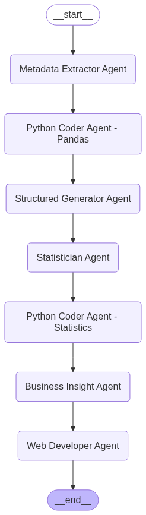

# 🚀 CognitoEDA

[](https://github.com/Rishav1996/CognitoEDA/releases)
[](https://github.com/Rishav1996/CognitoEDA/)
[](https://github.com/Rishav1996/CognitoEDA/commit/)
[](https://gitHub.com/Rishav1996/CognitoEDA/commit/)

**CognitoEDA** is an agentic workflow for automated Exploratory Data Analysis (EDA) using Large Language Models (LLMs) and Pandas. The project leverages LangChain, LangGraph, and Google Gemini models to extract metadata, generate EDA queries, and produce human-readable structured reports from tabular data.

---

## ✨ Features

- **Automated Metadata Extraction:**  
  Uses LLM agents to analyze a DataFrame and suggest relevant EDA steps.
- **Agentic Query Execution:**  
  Dynamically executes EDA queries on your data using a secure, sandboxed Python environment.
- **Structured Reporting:**  
  Converts EDA results into a human-friendly, structured document.
- **Interactive UI:**
  A Streamlit application provides a user-friendly interface for uploading data, running the EDA process, and viewing the results.
- **Extensible Workflow:**  
  Modular design for easy extension with new agents, prompts, or data sources.

---

## 📁 Project Structure

```
CognitoEDA/
│
├── src/
│   ├── app.py             # Main Streamlit application
│   ├── graph.py           # Core agentic workflow logic
│   ├── page_section/      # Streamlit pages for the UI
│   │   ├── __init__.py
│   │   ├── agent_page.py
│   │   ├── history_page.py
│   │   └── intro_page.py
│   ├── static/
│   │   └── graph.png
│   ├── tools/
│   │   ├── __init__.py
│   │   ├── agents.py      # Agent definitions
│   │   ├── helper.py      # Helper functions
│   │   ├── prompt.py      # Prompt templates
│   │   ├── schema.py      # Pydantic schemas
│   │   └── support_tools.py # Custom tools for agents
│   └── utils/             # Utility scripts
│       ├── __init__.py
│       └── helper.py
│
├── .gitignore
├── pyproject.toml
├── README.md
├── requirements.txt
└── uv.lock
```

---

## ⚙️ How It Works

The application follows an agentic workflow orchestrated by LangGraph. The process is initiated and visualized in a Streamlit web interface.

1.  **User Interaction (Streamlit UI):**
    -   The user uploads a CSV file and specifies the target column and problem type (e.g., classification, regression).
    -   The main application is in `src/app.py`, which routes the UI to different pages defined in `src/page_section/`.

2.  **Agentic Workflow (`src/graph.py`):**
    -   The core logic is defined in `src/graph.py` as a state machine.
    -   **Metadata Extractor Agent:**  Analyzes the dataset's schema and proposes initial EDA steps.
    -   **Python Pandas Coder Agent:** Executes the EDA steps using Pandas and captures the results.
    -   **Structure Creator Agent:**  Organizes the EDA results into a structured format.
    -   **Statistics Generator Agent:**  Generates further statistical analysis questions.
    -   **Python Statistics Coder Agent:** Executes the statistical queries.
    -   **Business Insights Agent:**  Generates business insights from the collected data.
    -   **Web Developer Agent:**  Creates an HTML report summarizing the findings.

3.  **MLflow Integration:**
    -   The application is integrated with MLflow for experiment tracking and logging of agent runs.

---

## 📈 Agentic Workflow



---

## 🚦 Example Usage

1. **Create a virtual environment:**  
   ```bash
   uv venv
   ```

2. **Install dependencies:**  
   ```bash
   uv add -r requirements.txt
   ```

3. **Run the MLflow server:**
   ```bash
   uv run mlflow server
   ```

4. **Run the application:**  
   ```bash
   uv run streamlit run ./src/app.py
   ```

5. **Access the application:**  
   Open your web browser and navigate to the URL provided by Streamlit (usually `http://127.0.0.1:8501`).

---

## 🎥 Demo

Here is a short video demonstrating the application in action:

<video controls src="https://raw.githubusercontent.com/Rishav1996/CognitoEDA/main/src/static/video.mp4" title="CognitoEDA Demo"></video>

---

## 📝 Requirements

- Python 3.11+
- All dependencies are listed in [`requirements.txt`](requirements.txt) and [`pyproject.toml`](pyproject.toml).

---

## 🛠️ Key Technologies

- [LangChain](https://python.langchain.com/)
- [LangGraph](https://github.com/langchain-ai/langgraph)
- [Google Gemini (via LangChain)](https://python.langchain.com/docs/integrations/chat/google_genai)
- [Pandas](https://pandas.pydata.org/)
- [Pydantic](https://docs.pydantic.dev/)
- [MLflow](https://mlflow.org/)
- [Streamlit](https://docs.streamlit.io/)
- [Streamlit Option Menu](https://pypi.org/project/streamlit-option-menu/)
- [pytest](https://docs.pytest.org/)
- [python-dotenv](https://pypi.org/project/python-dotenv/)
- [arxiv](https.pypi.org/project/arxiv/)
- [duckduckgo-search](https://pypi.org/project/duckduckgo-search/)


---

## ⚠️ Security Notice

The Pandas agent executes code in a Python REPL.  
**Ensure your environment is secure** and do not use untrusted data or prompts.

---

## 🧩 Customization

- **Prompts:**  
  Modify `src/tools/prompt.py` to change how the LLMs are instructed.
- **Schemas:**  
  Update `src/tools/schema.py` to adjust output formats.
- **Agents:**  
  Extend or modify agent logic in `src/tools/agents.py`.
- **Tools:**  
  Add or modify agent tools in `src/tools/support_tools.py`.

---

## 📄 License

This project is for research and educational purposes. Please review dependencies for their respective licenses.
